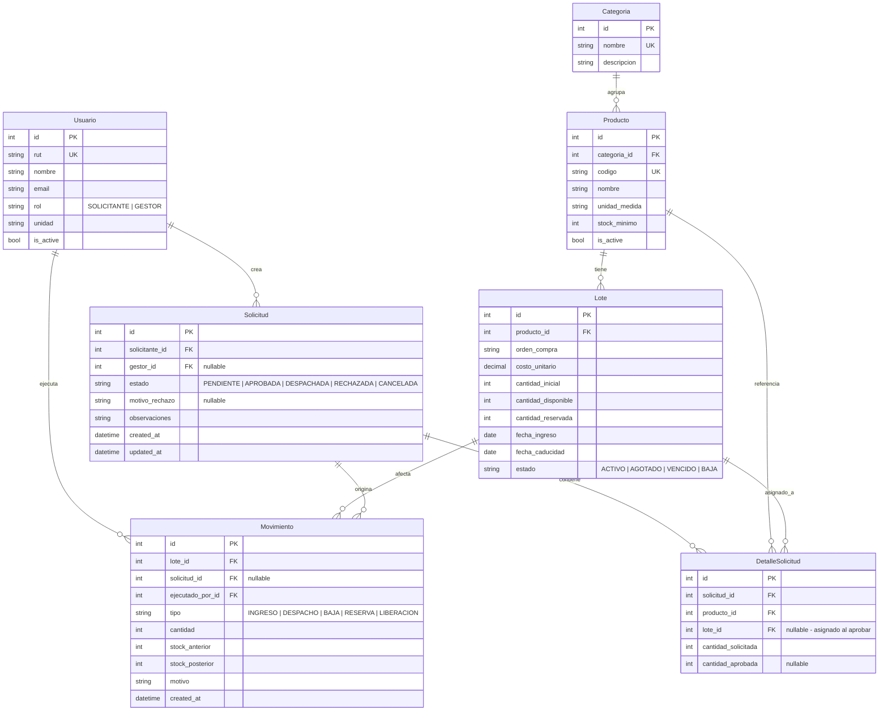
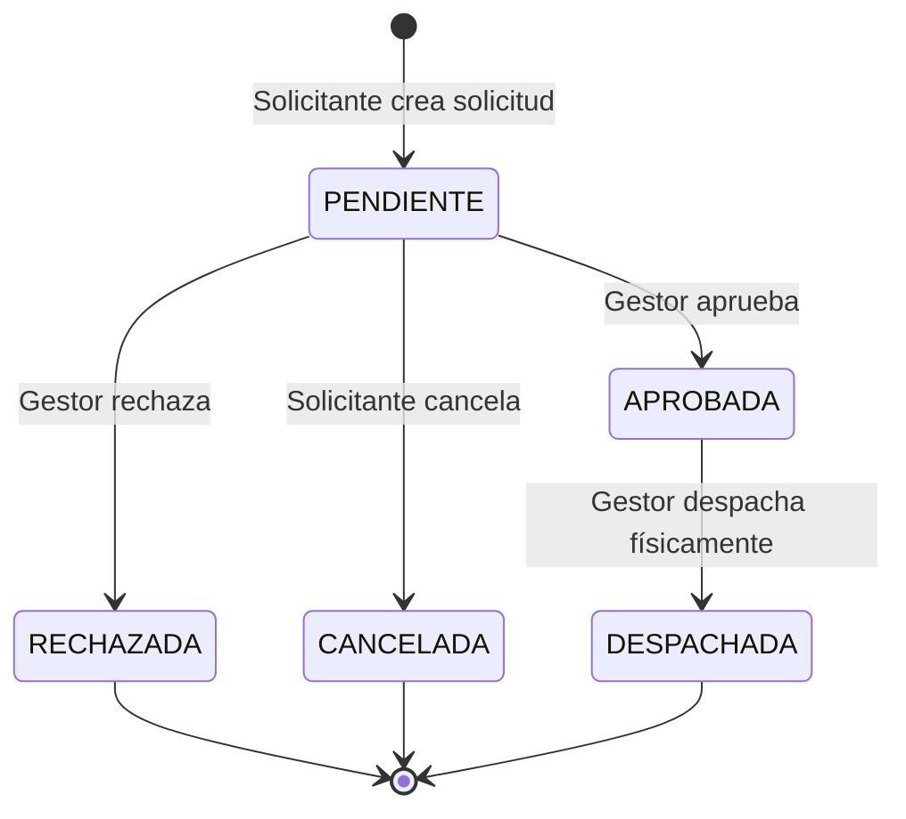

# Sistema de Gestión de Inventario — Comité Paritario

## 1. Contexto

Sistema de inventario gubernamental para un comité paritario que gestiona insumos por **lotes** (no por producto genérico). Requiere trazabilidad absoluta mediante un log inmutable de movimientos, flujo de solicitudes con reserva de stock, y control de acceso basado en roles (RBAC).

**Stack**: Django + DRF + PostgreSQL (backend) · Next.js (frontend) · JWT (auth)

---

## 2. Diseño de Base de Datos (MER)

### Diagrama Entidad-Relación



### Descripción de Modelos

#### `Usuario`
Extiende `AbstractUser` de Django. Campo `rol` como choices (`SOLICITANTE`, `GESTOR`). Campo `unidad` indica el departamento.

#### `Categoria`
Agrupación lógica de productos (Higiene, EPP, Oficina, etc.).

#### `Producto`
Catálogo maestro. **No almacena stock** — el stock se calcula sumando `cantidad_disponible` de sus lotes activos. `stock_minimo` permite alertas de stock crítico.

#### `Lote`
**Entidad central del inventario físico.** Cada ingreso crea un lote nuevo. Campos clave:
- `cantidad_disponible`: stock libre para despachar.
- `cantidad_reservada`: stock comprometido por solicitudes aprobadas aún no despachadas.
- **Invariante**: `cantidad_disponible + cantidad_reservada <= cantidad_inicial`
- `estado`: se calcula/actualiza automáticamente.

#### `Movimiento`
**Tabla transaccional inmutable (append-only).** Cada fila es un evento atómico. Campos `stock_anterior` y `stock_posterior` permiten auditoría punto a punto. **No se permiten UPDATE ni DELETE.**

| Tipo | Efecto en Lote |
|------|---------------|
| `INGRESO` | Crea lote, `cantidad_disponible = cantidad_inicial` |
| `RESERVA` | `disponible -= N`, `reservada += N` |
| `LIBERACION` | `disponible += N`, `reservada -= N` (rechazo/cancelación) |
| `DESPACHO` | `reservada -= N` (stock ya salió físicamente) |
| `BAJA` | `disponible -= N`, requiere `motivo` obligatorio |

#### `Solicitud`
Encabezado de la solicitud con su máquina de estados.

#### `DetalleSolicitud`
Líneas de la solicitud. Al crear, solo tiene `producto_id` + `cantidad_solicitada`. Al aprobar, el gestor asigna `lote_id` + `cantidad_aprobada` (puede ser menor a la solicitada).

### Manejo de Stock Real vs. Reservado

```
Stock Total del Producto = Σ (lote.cantidad_disponible + lote.cantidad_reservada) para lotes ACTIVOS
Stock Disponible        = Σ (lote.cantidad_disponible) para lotes ACTIVOS
Stock Reservado         = Σ (lote.cantidad_reservada) para lotes ACTIVOS
```

> [!IMPORTANT]
> Toda operación que modifique `cantidad_disponible` o `cantidad_reservada` de un lote **DEBE** ejecutarse dentro de una transacción con `select_for_update()` en el lote para prevenir race conditions, y **DEBE** crear un registro en `Movimiento`.

---

## 3. Máquina de Estados de la Solicitud



### Detalle de cada transición

| Transición | Actor | Acciones sobre Stock |
|---|---|---|
| **Crear** → `PENDIENTE` | Solicitante | Ninguna. Solo se valida que haya stock disponible suficiente como información al usuario. |
| `PENDIENTE` → `APROBADA` | Gestor | El gestor asigna lotes a cada línea. Se ejecuta `RESERVA`: `lote.disponible -= N`, `lote.reservada += N`. Se crea Movimiento tipo RESERVA por cada lote afectado. |
| `PENDIENTE` → `RECHAZADA` | Gestor | Ningún cambio en stock. Se exige `motivo_rechazo`. |
| `PENDIENTE` → `CANCELADA` | Solicitante | Ningún cambio (no se había reservado nada). |
| `APROBADA` → `DESPACHADA` | Gestor | Se ejecuta `DESPACHO`: `lote.reservada -= N`. Se crea Movimiento tipo DESPACHO. El stock ya sale físicamente del inventario. |

> [!NOTE]
> La reserva se hace al **aprobar**, no al crear la solicitud. Esto evita que solicitudes pendientes indefinidamente bloqueen stock.

---

## 4. Definición de Endpoints Core

Base URL: `/api/v1/`

### Autenticación

| Método | Endpoint | Descripción | Rol |
|--------|----------|-------------|-----|
| POST | `/auth/login/` | Obtener JWT (access + refresh) | Todos |
| POST | `/auth/refresh/` | Refrescar token | Todos |
| GET | `/auth/me/` | Perfil del usuario autenticado | Todos |

### Catálogo (Productos y Categorías)

| Método | Endpoint | Descripción | Rol |
|--------|----------|-------------|-----|
| GET | `/categorias/` | Listar categorías | Todos |
| POST | `/categorias/` | Crear categoría | Gestor |
| GET | `/productos/` | Listar productos con stock agregado | Todos |
| POST | `/productos/` | Crear producto en catálogo | Gestor |
| PATCH | `/productos/{id}/` | Editar producto | Gestor |

### Lotes

| Método | Endpoint | Descripción | Rol |
|--------|----------|-------------|-----|
| GET | `/lotes/` | Listar lotes (filtros: producto, estado, vencimiento) | Gestor |
| POST | `/lotes/` | Registrar nuevo lote (crea Movimiento INGRESO) | Gestor |
| GET | `/lotes/{id}/` | Detalle de lote | Gestor |
| POST | `/lotes/{id}/baja/` | Dar de baja lote (parcial o total, crea Movimiento BAJA) | Gestor |

### Solicitudes

| Método | Endpoint | Descripción | Rol |
|--------|----------|-------------|-----|
| GET | `/solicitudes/` | Listar solicitudes (Solicitante: las suyas; Gestor: todas) | Todos |
| POST | `/solicitudes/` | Crear solicitud con detalles | Solicitante |
| GET | `/solicitudes/{id}/` | Detalle con líneas | Todos (owner o Gestor) |
| POST | `/solicitudes/{id}/aprobar/` | Aprobar y reservar stock | Gestor |
| POST | `/solicitudes/{id}/rechazar/` | Rechazar con motivo | Gestor |
| POST | `/solicitudes/{id}/cancelar/` | Cancelar solicitud propia | Solicitante (owner) |
| POST | `/solicitudes/{id}/despachar/` | Confirmar despacho físico | Gestor |

### Movimientos (Solo lectura)

| Método | Endpoint | Descripción | Rol |
|--------|----------|-------------|-----|
| GET | `/movimientos/` | Historial (filtros: tipo, lote, fecha, ejecutor) | Gestor |

### Reportes

| Método | Endpoint | Descripción | Rol |
|--------|----------|-------------|-----|
| GET | `/reportes/consumo-funcionario/` | Consumo por funcionario en rango de fechas | Gestor |
| GET | `/reportes/costos/` | Costos asociados a despachos | Gestor |
| GET | `/reportes/stock-critico/` | Productos bajo stock mínimo | Gestor |
| GET | `/reportes/proximos-vencer/` | Lotes próximos a vencer (param: días) | Gestor |

---

## 5. Estructura del Proyecto

```
gestor_inventario/
├── backend/
│   ├── config/              # Settings, URLs raíz, ASGI/WSGI
│   │   ├── settings/
│   │   │   ├── base.py
│   │   │   ├── development.py
│   │   │   └── production.py
│   │   ├── urls.py
│   │   └── wsgi.py
│   ├── apps/
│   │   ├── usuarios/        # Modelo User custom, serializers, auth views
│   │   ├── catalogo/        # Producto, Categoria
│   │   ├── inventario/      # Lote, Movimiento + servicios transaccionales
│   │   └── solicitudes/     # Solicitud, DetalleSolicitud + máquina de estados
│   ├── core/                # Permisos RBAC, paginación, mixins
│   ├── requirements/
│   │   ├── base.txt
│   │   ├── dev.txt
│   │   └── prod.txt
│   └── manage.py
├── frontend/
│   ├── src/
│   │   ├── app/             # App Router de Next.js
│   │   ├── components/      # Componentes reutilizables
│   │   ├── lib/             # API client, auth helpers
│   │   └── types/           # TypeScript interfaces
│   ├── package.json
│   └── next.config.js
├── docker-compose.yml
├── .env.example
└── README.md
```

---

## 6. Decisiones Técnicas Clave

| Decisión | Justificación |
|----------|---------------|
| `select_for_update()` en lotes | Previene race conditions en operaciones concurrentes de stock |
| Movimientos append-only | Sin UPDATE/DELETE en la tabla. Garantiza trazabilidad absoluta |
| Stock calculado desde lotes | El Producto no almacena stock; se agrega dinámicamente con `annotate()` |
| Reserva al aprobar (no al solicitar) | Evita bloqueo de stock por solicitudes que nunca se procesan |
| Settings split (base/dev/prod) | Evita configuración errónea entre ambientes |
| Service Layer para transacciones | Lógica de negocio en `services.py`, no en views ni serializers |

---

## 7. Roadmap de Desarrollo — 4 Sprints

### Sprint 1: Fundación y Core Transaccional (Semana 1-2)

**Objetivo**: Backend funcional con modelos, auth y operaciones de inventario testeadas.

- [x] Inicializar proyecto Django con estructura de apps
- [ ] Configurar PostgreSQL + settings split
- [ ] Modelo `Usuario` custom (extends AbstractUser) con roles
- [ ] Modelos `Categoria`, `Producto`
- [ ] Modelos `Lote`, `Movimiento`
- [ ] Service layer: `InventarioService`
  - `registrar_lote()` → crea Lote + Movimiento INGRESO
  - `dar_baja()` → actualiza Lote + Movimiento BAJA (con motivo obligatorio)
- [ ] Permisos RBAC (`IsGestor`, `IsSolicitante`, `IsOwner`)
- [ ] Auth con `djangorestframework-simplejwt`
- [ ] Endpoints: Auth, Categorías, Productos, Lotes
- [ ] Tests unitarios del service layer (transacciones, race conditions)

### Sprint 2: Flujo de Solicitudes (Semana 3-4)

**Objetivo**: Máquina de estados completa con reserva/liberación de stock.

- [ ] Modelos `Solicitud`, `DetalleSolicitud`
- [ ] Service layer: `SolicitudService`
  - `crear_solicitud()` → estado PENDIENTE
  - `aprobar_solicitud()` → asignar lotes, RESERVA, estado APROBADA
  - `rechazar_solicitud()` → motivo, estado RECHAZADA
  - `cancelar_solicitud()` → estado CANCELADA
  - `despachar_solicitud()` → DESPACHO, estado DESPACHADA
- [ ] Endpoints de solicitudes con permisos por rol
- [ ] Endpoint de movimientos (solo lectura, filtrado)
- [ ] Tests del flujo completo de solicitudes
- [ ] Validaciones: stock suficiente, transiciones de estado válidas

### Sprint 3: Frontend Core (Semana 5-6)

**Objetivo**: Interfaz funcional para ambos roles.

- [ ] Inicializar Next.js con TypeScript + App Router
- [ ] API client con interceptor JWT (refresh automático)
- [ ] Layout con navegación basada en rol
- [ ] **Gestor**: Dashboard (stock crítico, próximos a vencer)
- [ ] **Gestor**: CRUD de productos y categorías
- [ ] **Gestor**: Registro de lotes + baja con motivo
- [ ] **Gestor**: Bandeja de solicitudes (aprobar/rechazar/despachar)
- [ ] **Solicitante**: Catálogo con stock disponible
- [ ] **Solicitante**: Formulario de solicitud
- [ ] **Solicitante**: Historial de solicitudes propias

### Sprint 4: Reportes y Producción (Semana 7-8)

**Objetivo**: Reportabilidad completa y deploy.

- [ ] Endpoints de reportes (consumo, costos, stock crítico, vencimientos)
- [ ] Vistas de reportes en frontend (tablas + gráficos)
- [ ] Exportación a CSV/Excel
- [ ] Tarea programada: marcar lotes vencidos (`django-celery-beat` o cron)
- [ ] Dockerización (docker-compose con Django + PostgreSQL + Next.js)
- [ ] Variables de entorno y configuración de producción
- [ ] Deploy en servidor Ubuntu existente
- [ ] Documentación de API (drf-spectacular / Swagger)

---

## Open Questions

> [!IMPORTANT]
> **1. Autenticación de usuarios**: ¿Los usuarios se autenticarán con credenciales propias del sistema, o existe un directorio activo / SSO institucional al que debamos integrarnos?

> [!IMPORTANT]
> **2. Volumen estimado**: ¿Cuántos productos, lotes y solicitudes mensuales se estiman? Esto impacta decisiones de paginación y posible caché.

> [!NOTE]
> **3. Notificaciones**: ¿Se requiere notificar al solicitante cuando su solicitud cambie de estado (email, en-app, o ambas)?

> [!NOTE]
> **4. Multi-sede**: ¿El comité opera en una sola ubicación física o hay múltiples bodegas/sedes?

> [!NOTE]
> **5. Firma digital**: ¿Las bajas o despachos requieren algún tipo de firma electrónica o basta con el registro del funcionario?
